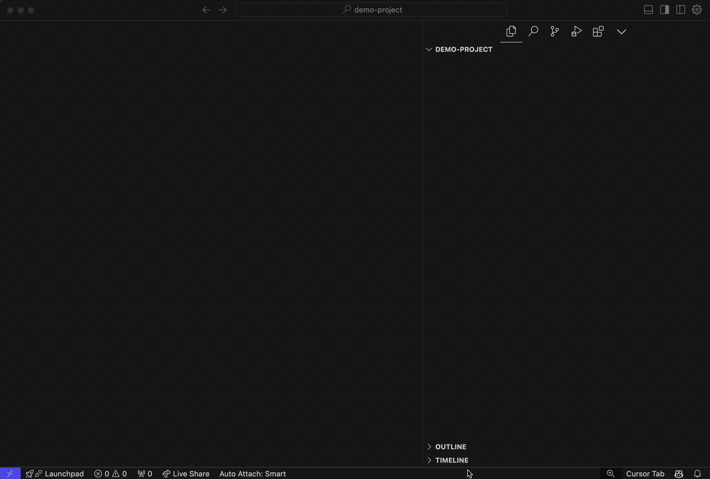

# Cursor Rules Downloader

[](https://marketplace.visualstudio.com/items?itemName=juanmaguitar.cursor-rules-downloader)
[](https://marketplace.visualstudio.com/items?itemName=juanmaguitar.cursor-rules-downloader)
[](https://opensource.org/licenses/MIT)

## Main Features

- Support for configurable repository sources via `cursorRules.repos` setting
  - Repository order in settings determines the order of rules in the Command Palette

```
"cursorRules.repos": [
    "https://github.com/juanma-ai/my-cursor-rules/tree/main/.cursor/rules"
  ]
```

> [!NOTE]
> Any repo added to `cursorRules.repos` must include the path of the `.cursor/rules` folder of the repo. Cursor rules under that folder should also have the `*.mdc` extension.

- Source indicator in QuickPick UI showing which repository each rule comes from
- Download fetched rules from remote repos directly into the `.cursor/rules` folder of your project

## Usage

- Open the command palette (Cmd+Shift+P or Ctrl+Shift+P) and type "Cursor Rules Downloader: Add .cursor/rules".



## Credits

This extension is based on the original work by [BeilunYang](https://github.com/beilunyang). Original repository: [vscode-cursor-rules](https://github.com/beilunyang/vscode-cursor-rules)

## License

[MIT License](LICENSE).
